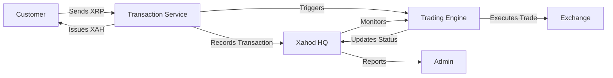

# Xahod HQ Documentation

## Overview

Xahod HQ is an administrative interface for managing and monitoring the XAH/XRP exchange service. The system handles two primary types of operations:

1. **Transactions**: Customer-facing XRP to XAH exchanges
2. **Trades**: Backend market operations to realize profits from transactions

## Table of Contents

1. [System Architecture](#system-architecture)
2. [Core Concepts](#core-concepts)
3. [User Guide](#user-guide)
4. [Technical Documentation](#technical-documentation)
5. [Development Guide](#development-guide)
6. [API Reference](#api-reference)
7. [Troubleshooting](#troubleshooting)

## System Architecture

### Components

- **Frontend**: Vue 3 + TypeScript application
- **Backend**: Azure Functions
- **Authentication**: Azure AD
- **Database**: Azure CosmosDB
- **Monitoring**: Application Insights

### Data Flow



## Core Concepts

### Transactions

A transaction represents a customer's request to exchange XRP for XAH. Each transaction goes through several states:

1. **INITIATED**: XRP payment detected
2. **PROCESSING**: XAH issuance in progress
3. **ISSUED**: XAH sent to customer
4. **COMPLETED**: XRP sold and profit realized
5. **FAILED**: Error occurred during process

### Trades

A trade represents a market operation performed to realize profit from a transaction:

1. **Sell Trade**: Selling received XRP on exchange
2. **Buy Trade**: Repurchasing XAH to maintain inventory
3. **Profit Calculation**: Difference between sell and buy prices

### Market Data

The system tracks several key metrics:

- XRP/USDT price
- XAH/USDT price
- XAH/XRP floating rate
- Trading volume
- Profitability metrics
- Market conditions

## User Guide

### Dashboard

The dashboard provides an overview of:

- Active transactions
- Recent trades
- Current market rates
- System health metrics
- Profitability indicators

### Transaction Management

#### Viewing Transactions
1. Navigate to Transactions page
2. Use filters to find specific transactions
3. Click on a transaction for details

#### Transaction Details
- Transaction ID (UTID)
- Status and timestamps
- XRP and XAH amounts
- Associated trades
- Profitability data

### Trading Interface

#### Market Overview
- Real-time price charts
- Volume indicators
- Rate comparisons
- Profitability metrics

#### Trading Analytics
- Success rate analysis
- Volume analysis
- Market condition indicators
- Trading recommendations

### System Settings

#### Configuration Options
- Rate thresholds
- Trading parameters
- Notification settings
- User permissions

## Technical Documentation

### Frontend Architecture

#### State Management
```typescript
// Store structure
interface MarketStore {
  xrpPrice: number
  xahPrice: number
  floatingRate: number
  trades24h: Trade[]
  historicalData: HistoricalData
  // ... other properties
}
```

#### Component Hierarchy
```
App
├── AppLayout
│   ├── Navigation
│   └── ContentArea
├── DashboardPage
│   ├── MetricsPanel
│   └── ActivityFeed
├── TransactionsPage
│   ├── TransactionList
│   └── TransactionDetails
└── TradingPage
    ├── TradingMetrics
    ├── TradingChart
    └── TradingAnalytics
```

### Data Models

#### Transaction Model
```typescript
interface Transaction {
  utid: string
  status: TransactionStatus
  xrpAmount: string
  xahAmount: string
  timestamp: string
  xrpTxHash: string
  xahTxHash: string
  profitStatus: ProfitStatus
  profitability?: number
}
```

#### Trade Model
```typescript
interface Trade {
  id: string
  type: 'SELL' | 'BUY'
  asset: 'XRP' | 'XAH'
  amount: string
  price: string
  timestamp: string
  status: TradeStatus
  relatedTransaction: string
  profitability?: number
}
```

### API Integration

#### Endpoints
- `/api/transactions`: Transaction management
- `/api/trades`: Trade operations
- `/api/market`: Market data
- `/api/analytics`: Analytics and reporting

#### Authentication
- Azure AD integration
- Role-based access control
- Token management

### Error Handling

#### Global Error Handler
```typescript
app.config.errorHandler = (error, instance, info) => {
  logger.error('Vue error:', { error, info, component: instance?.$options.name })
  
  if (error.response?.status === 401) {
    // Handle authentication errors
  } else if (!networkStore.online) {
    // Handle offline mode
  }
  // ... other error handling
}
```

#### Offline Support
- Data caching
- Optimistic updates
- Retry mechanisms

## Development Guide

### Setup

1. Clone repository
2. Install dependencies
3. Configure environment
4. Start development server

### Testing

#### Unit Tests
```bash
# Run unit tests
npm run test:unit

# Run with coverage
npm run test:coverage
```

#### E2E Tests
```bash
# Run e2e tests
npm run test:e2e

# Run specific test
npm run test:e2e -- --spec "tests/e2e/transactions.test.ts"
```

### Code Style

#### TypeScript
- Strict type checking
- Interface-first design
- Proper error handling

#### Vue Components
- Composition API
- Single responsibility
- Props validation

### Git Workflow

1. Branch naming:
   - `feature/description`
   - `fix/description`
   - `improve/description`

2. Commit messages:
   - `feat: description`
   - `fix: description`
   - `improve: description`

## API Reference

### Transactions API

#### Get Transactions
```http
GET /api/transactions
Query parameters:
- status: TransactionStatus
- from: ISO date
- to: ISO date
- limit: number
```

#### Get Transaction Details
```http
GET /api/transactions/:utid
Response:
{
  utid: string
  status: TransactionStatus
  xrpAmount: string
  xahAmount: string
  // ... other fields
}
```

### Market API

#### Get Market Data
```http
GET /api/market/data
Response:
{
  xrpPrice: number
  xahPrice: number
  floatingRate: number
  // ... other metrics
}
```

#### Get Historical Data
```http
GET /api/market/historical
Query parameters:
- timeframe: '1h' | '4h' | '24h' | '7d'
- metrics: string[]
```

## Troubleshooting

### Common Issues

#### Authentication Problems
- Token expiration
- Permission issues
- Network connectivity

#### Data Synchronization
- Cache invalidation
- Conflict resolution
- Real-time updates

#### Performance Issues
- Data loading
- Chart rendering
- State management

### Monitoring

#### Logging
- Application logs
- Error tracking
- Performance metrics

#### Alerts
- System health
- Market conditions
- Error thresholds

### Recovery Procedures

1. Authentication Reset
2. Cache Clearing
3. State Recovery
4. Error Resolution